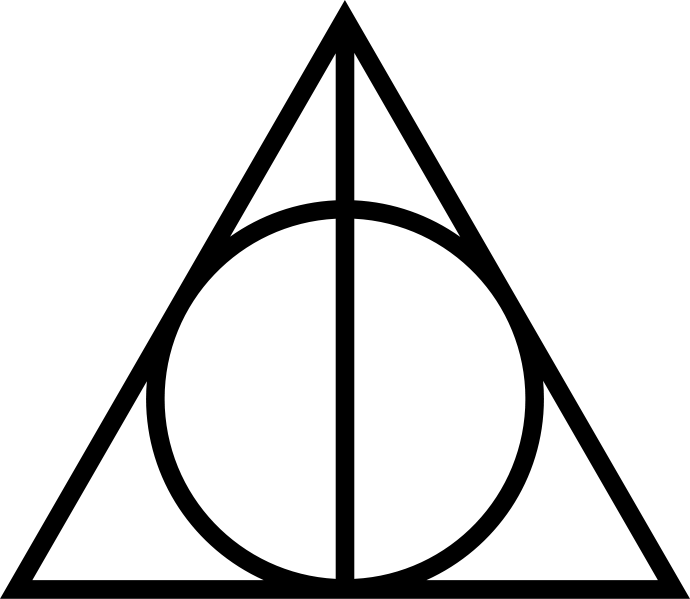
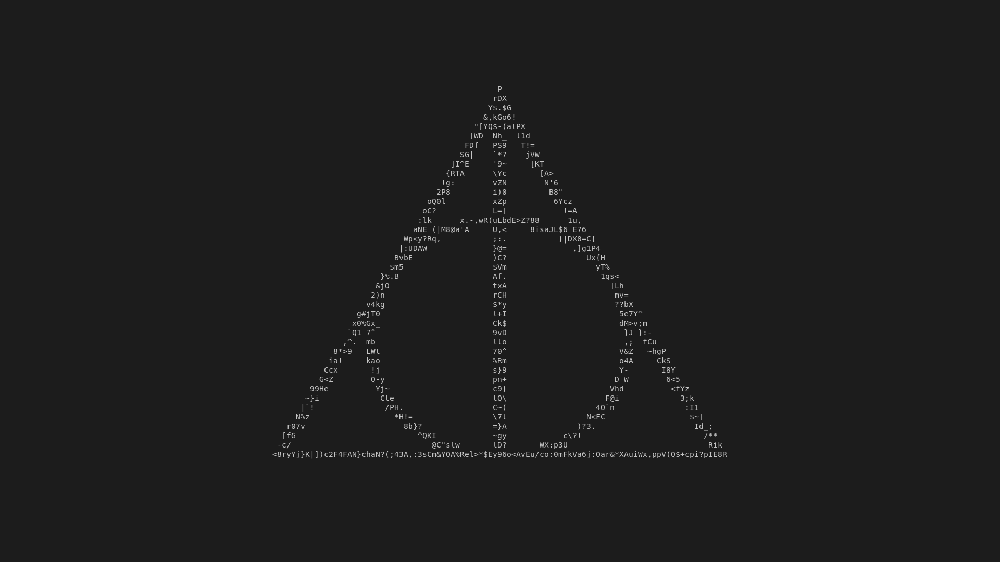
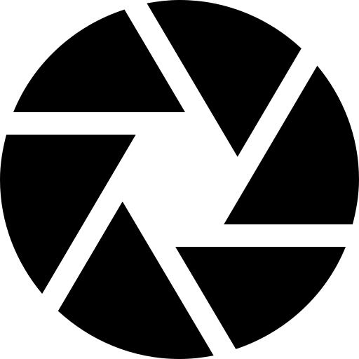
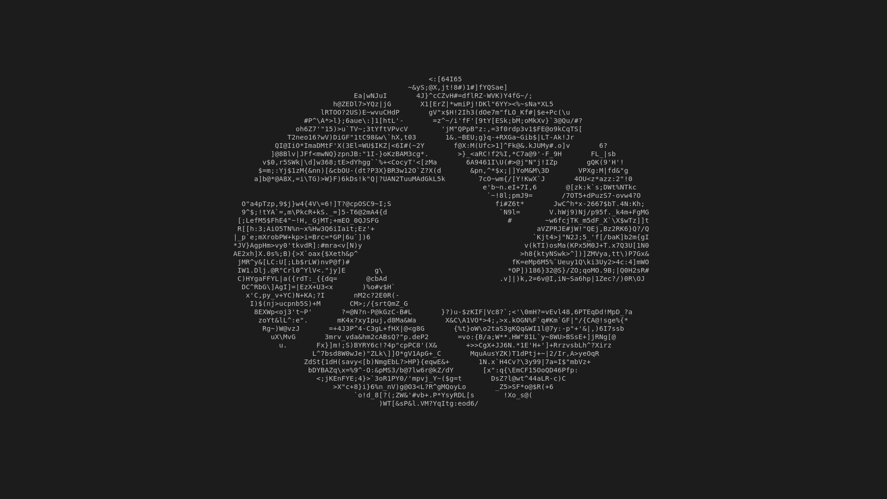

# Matrix Effect with a Image mask

This script allows one to draw matrix-styled effects with a source image to terminal.

## Examples

### A non suspicious trinagle

Source:

Rendered with `mmatrix.py -m ./examples/hollows.png -x 100 -y 40`:

### Camera aperture 

Source:

*Icon made by Freepik*

Rendered with `mmatrix.py -m ./examples/aperture.png -x 100 -y 40`:

